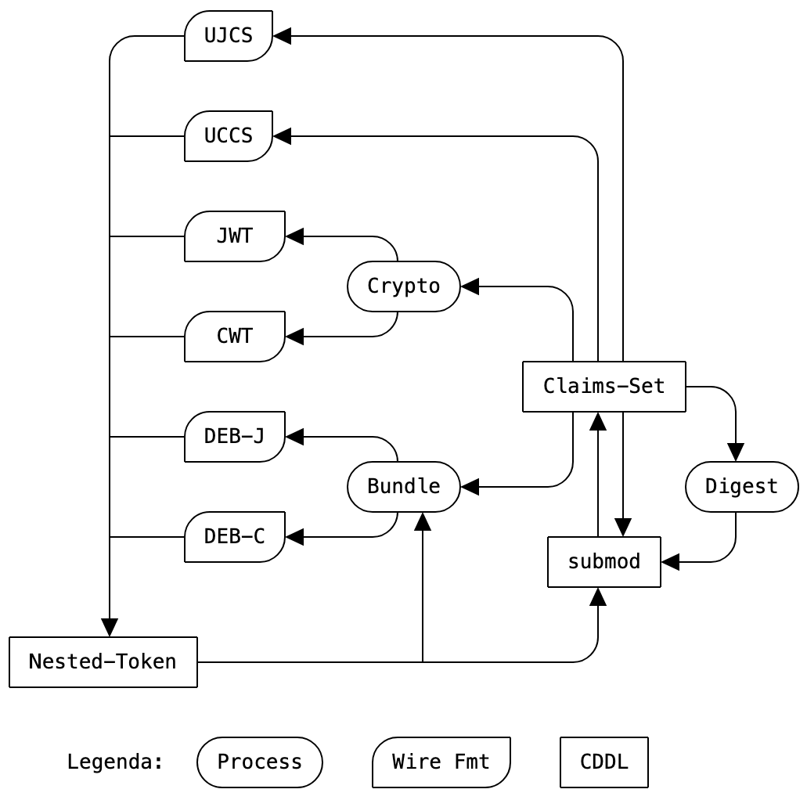

slidenumbers: true

# EAT Media Types

## Carrying EAT around

[https://datatracker.ietf.org/doc/draft-lundblade-rats-eat-media-type/](https://datatracker.ietf.org/doc/draft-lundblade-rats-eat-media-type)

## RATS WG, IETF 114

---



---

# Base Types

| Name | Template |
| ---- | -------- |
| EAT CWT | `application/eat-cwt` |
| EAT JWT | `application/eat-jwt` |
| EAT CBOR DEB | `application/eat-deb+cbor` |
| EAT JSON DEB | `application/eat-deb+json` |
| EAT UCCS | `application/eat-ucs+cbor` |
| EAT UJCS | `application/eat-ucs+json` |

---

# The "profile" parameter

* An optional `profile` parameter mirrors the `eat_profile` claim value of the transported EAT
  * dotted-decimal absolute OID or URI
* To help API routing middleware, application servers and the like

* A fine-grained and scalable type system that matches the inherent extensibility of EAT

---

# Example (Successful negotiation)

```
  POST /challenge-response/v1/session/02a4fe12-1887-4a24-9d61-4b76b0f3c488 HTTP/1.1
  Host: verifier.example
  Accept: application/eat-cwt; profile=tag:ar4si.example,2021
  Content-Type: application/eat-cwt; profile=tag:evidence.example,2022

  [ CBOR-encoded EAT w/ profile=tag:evidence.example,2022 ]

...

  HTTP/1.1 200 OK
  Content-Type: application/eat-cwt; profile=tag:ar4si.example,2021

  [ CBOR-encoded EAT w/ profile=tag:ar4si.example,2021 ]
```

---

# Example (Failed negotiation)

```
  POST /verify/my-evidence HTTP/1.1
  Host: verifier.example
  Accept: application/eat-cwt; profile=tag:ar4si.example,2021
  Content-Type: application/eat-cwt; profile=tag:evidence.example,3022

  [ CBOR-encoded EAT w/ profile=tag:evidence.example,3022 ]

...

  HTTP/1.1 415 Unsupported Media Type
  Accept: application/eat-cwt; profile=tag:ar4si.example,2022
```

---

# Adopt?
