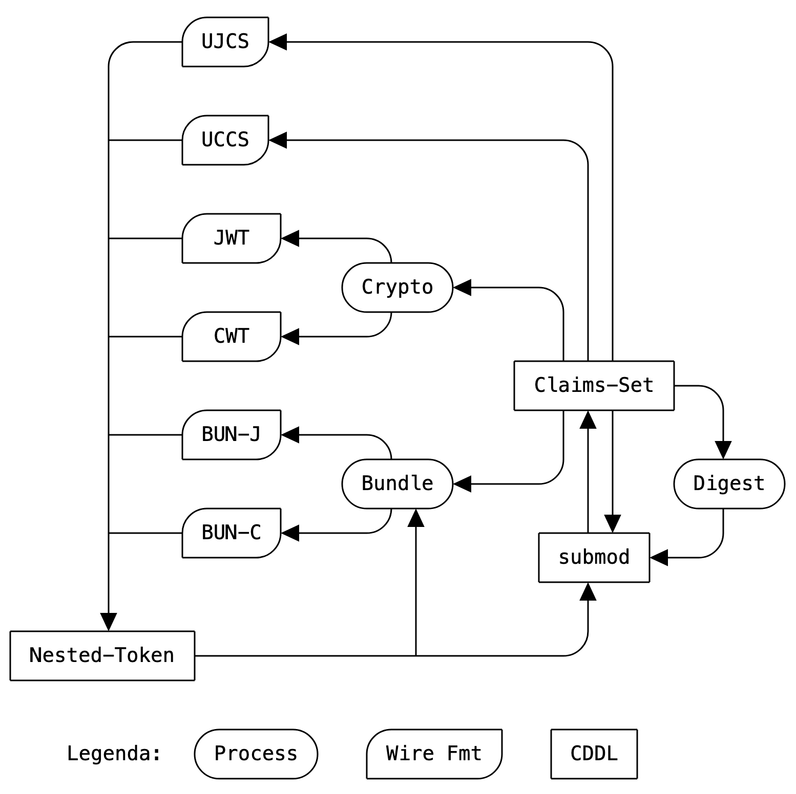

slidenumbers: true
autoscale: true

# EAT Media Types

## [draft-ietf-rats-eat-media-type-01](https://datatracker.ietf.org/doc/draft-ietf-rats-eat-media-type/01)

### RATS WG, IETF 115, London

---

# Quick recap

---



---

# Base Types

| Name | Template |
| ---- | -------- |
| EAT CWT | `application/eat-cwt` |
| EAT JWT | `application/eat-jwt` |
| Detached EAT Bundle CBOR | `application/eat-bun+cbor` |
| Detached EAT Bundle JSON | `application/eat-bun+json` |
| EAT UCCS | `application/eat-ucs+cbor` |
| EAT UJCS | `application/eat-ucs+json` |

---

# Changes since IETF 114

* `draft-lundblade-eat-media-type` adopted

* [[Issue#4](https://github.com/ietf-rats-wg/draft-eat-mt/issues/4)] Renamed `profile` to `eat_profile` for consistency with EAT

* [[Issue#8](https://github.com/ietf-rats-wg/draft-eat-mt/issues/8)] The DEB acronym is gone from EAT: shorthand is now "bun" from bundle

* [[Issue#7](https://github.com/ietf-rats-wg/draft-eat-mt/issues/7)], [[Issue#9](https://github.com/ietf-rats-wg/draft-eat-mt/issues/9)] Incorporate editorial suggestions from Carl and Dave

---

# Open Issues

* [[Issue#6](https://github.com/ietf-rats-wg/draft-eat-mt/issues/6)] - new CoAP option for carrying the profile information (_non-blocking_)
* [[Issue#10](https://github.com/ietf-rats-wg/draft-eat-mt/issues/10)] - use cases and rationale
* [[Issue#12](https://github.com/ietf-rats-wg/draft-eat-mt/issues/12)] - early allocation of the media types

---

# Early Allocation Questionnaire

:white_check_mark: The code points must be from a space designated as "RFC Required", "IETF Review", or "Standards Action". Additionally, requests for early assignment of code points from a "Specification Required" registry are allowed if the specification will be published as an RFC.

^ yes, as we are requesting from the standard tree

:white_check_mark: The format, semantics, processing, and other rules related to handling the protocol entities defined by the code points (henceforth called "specifications") must be adequately described in an Internet-Draft.

^ yes, draft-ietf-rats-eat-media-type is that Internet-Draft

:white_check_mark: The specifications of these code points must be stable; i.e., if there is a change, implementations based on the earlier and later specifications must be seamlessly interoperable.

^ yes, we have no reason to think they are not stable

:question: The Working Group chairs and Area Directors (ADs) judge that there is sufficient interest in the community for early (pre-RFC) implementation and deployment, or that failure to make an early allocation might lead to contention for the code point in the field.

---

# Next Steps (find the bug, win a beer!)

[.column]

```golang
func nextSteps(earlyAllocation bool) {
	waitChan := make(chan bool)

	if earlyAllocation {
		go IANA(waitChan)
	}

	for _, issue := range openIssues {
		if issue.isBlocking {
			sendPR(issue)
		}
	}

	<-waitChan

	submit(0x02)
}
```

[.column]

```golang
func IANA(waitChan chan bool) {
	fmt.Println("do it!")

	// actually do it

	waitChan <- true
}
```
